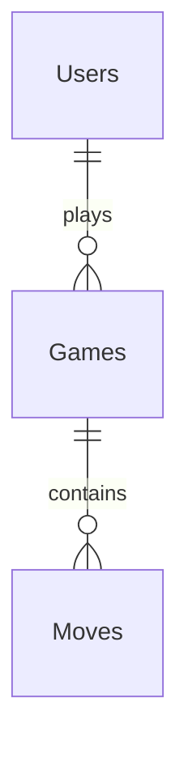

# データベースモデル設計仕様書

## 1. 概要
Octo_Reversi のデータ構造を定義します。

## 2. エンティティ定義
### Users (ユーザー)
- `id`: UUID (PK)
- `username`: String
- `email`: String (Unique)
- `password_hash`: String
- `created_at`: Timestamp

### Games (ゲームセッション)
- `id`: UUID (PK)
- `player_black_id`: UUID (FK to Users)
- `player_white_id`: UUID (FK to Users)
- `status`: Enum (WAITING, PLAYING, FINISHED)
- `created_at`: Timestamp

### Moves (着手履歴)
- `id`: UUID (PK)
- `game_id`: UUID (FK to Games)
- `player_id`: UUID (FK to Users)
- `position_x`: Integer
- `position_y`: Integer
- `move_number`: Integer
- `created_at`: Timestamp

## 3. ER図 (Mermaid表記)

