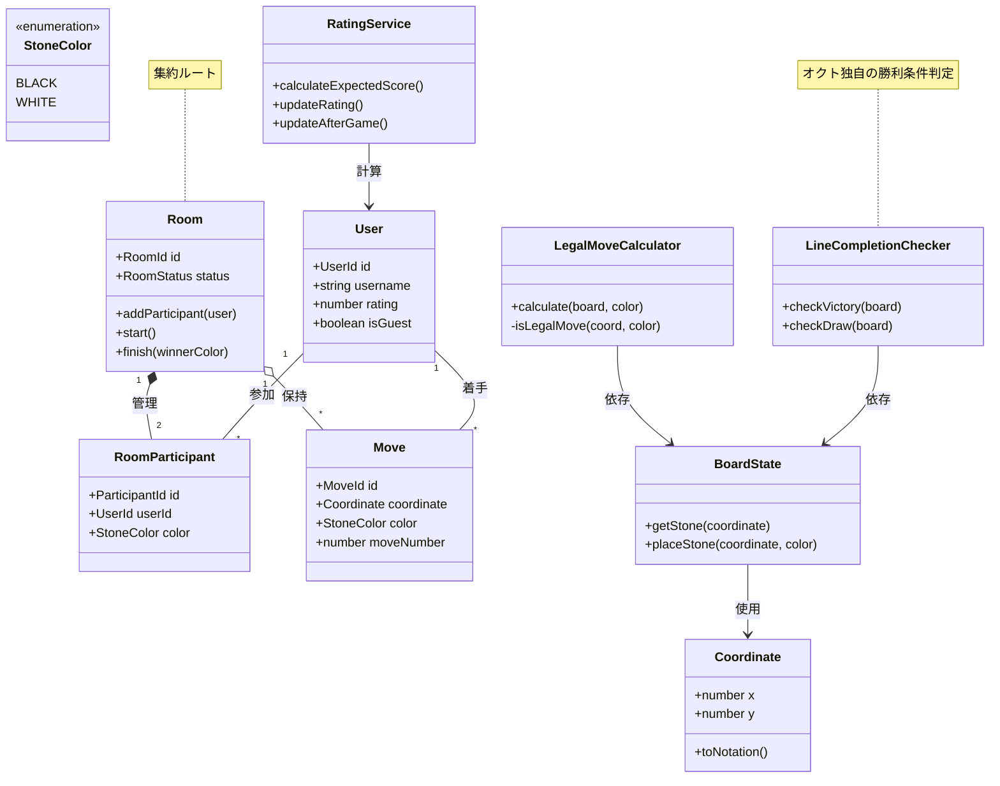

# オクト対戦 ドメインモデル設計

## 1. ユビキタス言語

### 1.1 用語定義

| 用語 | 説明 |
|------|------|
| **部屋 (Room)** | 対戦セッションを管理する集約のルート |
| **参加者 (Participant)** | 部屋に参加し、特定の色（黒/白）の石を担当するプレイヤー |
| **着手 (Move)** | 特定の座標に石を置く行為 |
| **盤面 (Board)** | 8×8のマス目と配置された石の状態 |
| **ライン (Line)** | 縦・横・斜めの8マス連続する位置の集合 |
| **パス (Pass)** | 合法手が存在しない場合のスキップ |

---

## 2. バウンデッドコンテキスト

### 2.1 対戦コンテキスト (Matching Context)

マッチングと部屋の管理を担当。

```
Matching
├── Room (部屋)
├── RoomParticipant (参加者)
└── MatchmakingService (マッチングサービス)
```

### 2.2 ゲームプレイコンテキスト (Gameplay Context)

対戦の進行とルール判定を担当。

```
Gameplay
├── Board (盤面)
├── Move (着手)
├── LineCompletionChecker (ライン完成判定)
└── LegalMoveCalculator (合法手計算)
```

### 2.3 ユーザーコンテキスト (User Context)

プレイヤーの認証とレーティング管理。

```
User
├── User (ユーザー)
└── RatingService (レーティング計算)
```

---

## 3. 値オブジェクト (Value Objects)

### 3.1 Coordinate (座標)

```typescript
class Coordinate {
  readonly x: number; // 0-7 (a-h)
  readonly y: number; // 0-7 (1-8)

  constructor(x: number, y: number) {
    if (x < 0 || x > 7) throw new Error("Invalid x coordinate");
    if (y < 0 || y > 7) throw new Error("Invalid y coordinate");
    this.x = x;
    this.y = y;
  }

  // オセロ記法への変換 (例: c4)
  toNotation(): string {
    return String.fromCharCode(97 + this.x) + (this.y + 1);
  }

  equals(other: Coordinate): boolean {
    return this.x === other.x && this.y === other.y;
  }
}
```

### 3.2 StoneColor (石の色)

```typescript
enum StoneColor {
  BLACK = "black",
  WHITE = "white"
}
```

### 3.3 BoardState (盤面状態)

```typescript
class BoardState {
  private cells: Map<string, StoneColor | null>;

  constructor() {
    this.cells = new Map();
    this.initialize();
  }

  private initialize(): void {
    // 初期配置: 白=d4,e5, 黒=e4,d5
    this.cells.set("3,3", StoneColor.WHITE);  // d4
    this.cells.set("4,4", StoneColor.WHITE);  // e5
    this.cells.set("4,3", StoneColor.BLACK);  // e4
    this.cells.set("3,4", StoneColor.BLACK);  // d5
  }

  getStone(coordinate: Coordinate): StoneColor | null {
    return this.cells.get(`${coordinate.x},${coordinate.y}`) ?? null;
  }

  placeStone(coordinate: Coordinate, color: StoneColor): void {
    this.cells.set(`${coordinate.x},${coordinate.y}`, color);
  }
}
```

---

## 4. エンティティ (Entities)

### 4.1 User (ユーザー)

```typescript
class User {
  readonly id: UserId;
  username: string;
  email: string | null;
  passwordDigest: string;
  rating: number; // Eloレーティング
  isGuest: boolean;
  createdAt: Date;

  canPlay(): boolean {
    return !this.isGuest || this.rating === 0;
  }
}
```

### 4.2 Room (部屋) - 集約ルート

```typescript
class Room {
  readonly id: RoomId;
  private participants: Map<StoneColor, RoomParticipant>;
  status: RoomStatus;
  startedAt: Date | null;
  finishedAt: Date | null;

  private constructor(
    id: RoomId,
    participants: RoomParticipant[],
    status: RoomStatus
  ) {
    this.id = id;
    this.participants = new Map(
      participants.map(p => [p.color, p])
    );
    this.status = status;
    this.startedAt = null;
    this.finishedAt = null;
  }

  // 新規部屋作成
  static create(hostUser: User): Room {
    const participant = RoomParticipant.create(
      hostUser,
      StoneColor.BLACK
    );
    return new Room(
      RoomId.generate(),
      [participant],
      RoomStatus.WAITING
    );
  }

  // 参加者追加
  addParticipant(user: User): void {
    if (this.participants.size >= 2) {
      throw new Error("Room is full");
    }
    const color = this.participants.has(StoneColor.BLACK)
      ? StoneColor.WHITE
      : StoneColor.BLACK;
    this.participants.set(color, RoomParticipant.create(user, color));
  }

  // ゲーム開始
  start(): void {
    if (this.participants.size !== 2) {
      throw new Error("Need 2 participants to start");
    }
    if (this.status !== RoomStatus.WAITING) {
      throw new Error("Room already started or finished");
    }
    this.status = RoomStatus.PLAYING;
    this.startedAt = new Date();
  }

  // ゲーム終了
  finish(winnerColor: StoneColor | null): void {
    this.status = RoomStatus.FINISHED;
    this.finishedAt = new Date();
    // TODO: レーティング更新イベント発行
  }

  canStart(): boolean {
    return this.participants.size === 2
      && this.status === RoomStatus.WAITING;
  }
}

enum RoomStatus {
  WAITING = "waiting",
  PLAYING = "playing",
  FINISHED = "finished"
}
```

### 4.3 RoomParticipant (部屋参加者)

```typescript
class RoomParticipant {
  readonly id: ParticipantId;
  readonly userId: UserId;
  readonly color: StoneColor;
  joinedAt: Date;

  static create(user: User, color: StoneColor): RoomParticipant {
    return new RoomParticipant(
      ParticipantId.generate(),
      user.id,
      color,
      new Date()
    );
  }
}
```

### 4.4 Move (着手)

```typescript
class Move {
  readonly id: MoveId;
  readonly roomId: RoomId;
  readonly userId: UserId;
  readonly coordinate: Coordinate;
  readonly color: StoneColor;
  readonly moveNumber: number;
  readonly createdAt: Date;

  constructor(
    id: MoveId,
    roomId: RoomId,
    userId: UserId,
    coordinate: Coordinate,
    color: StoneColor,
    moveNumber: number
  ) {
    this.id = id;
    this.roomId = roomId;
    this.userId = userId;
    this.coordinate = coordinate;
    this.color = color;
    this.moveNumber = moveNumber;
    this.createdAt = new Date();
  }
}
```

---

## 5. ドメインサービス (Domain Services)

### 5.1 LegalMoveCalculator (合法手計算機)

オセロのルールに基づいて合法手を計算。

```typescript
class LegalMoveCalculator {
  calculate(
    board: BoardState,
    color: StoneColor
  ): Coordinate[] {
    const legalMoves: Coordinate[] = [];

    for (let x = 0; x < 8; x++) {
      for (let y = 0; y < 8; y++) {
        const coord = new Coordinate(x, y);
        if (this.isLegalMove(board, coord, color)) {
          legalMoves.push(coord);
        }
      }
    }

    return legalMoves;
  }

  private isLegalMove(
    board: BoardState,
    coord: Coordinate,
    color: StoneColor
  ): boolean {
    // 既に石がある場合は着手不可
    if (board.getStone(coord) !== null) {
      return false;
    }

    // 8方向チェック
    const directions = [
      [-1, -1], [-1, 0], [-1, 1],
      [0, -1],           [0, 1],
      [1, -1],  [1, 0],  [1, 1]
    ];

    for (const [dx, dy] of directions) {
      if (this.canFlipInDirection(board, coord, dx, dy, color)) {
        return true;
      }
    }

    return false;
  }

  private canFlipInDirection(
    board: BoardState,
    start: Coordinate,
    dx: number,
    dy: number,
    color: StoneColor
  ): boolean {
    const opponent = color === StoneColor.BLACK
      ? StoneColor.WHITE
      : StoneColor.BLACK;
    let x = start.x + dx;
    let y = start.y + dy;
    let foundOpponent = false;

    while (x >= 0 && x < 8 && y >= 0 && y < 8) {
      const stone = board.getStone(new Coordinate(x, y));

      if (stone === null) {
        return false;
      }
      if (stone === opponent) {
        foundOpponent = true;
      } else if (stone === color) {
        return foundOpponent;
      }

      x += dx;
      y += dy;
    }

    return false;
  }
}
```

### 5.2 LineCompletionChecker (ライン完成判定)

オクト特有の勝利条件を判定。

```typescript
class LineCompletionChecker {
  checkVictory(board: BoardState): StoneColor | null {
    // 縦ライン
    for (let x = 0; x < 8; x++) {
      const winner = this.checkColumn(board, x);
      if (winner) return winner;
    }

    // 横ライン
    for (let y = 0; y < 8; y++) {
      const winner = this.checkRow(board, y);
      if (winner) return winner;
    }

    // 斜めライン
    const diag1 = this.checkDiagonal1(board);
    if (diag1) return diag1;

    const diag2 = this.checkDiagonal2(board);
    if (diag2) return diag2;

    return null;
  }

  private checkColumn(
    board: BoardState,
    x: number
  ): StoneColor | null {
    const firstColor = board.getStone(new Coordinate(x, 0));
    if (!firstColor) return null;

    for (let y = 1; y < 8; y++) {
      if (board.getStone(new Coordinate(x, y)) !== firstColor) {
        return null;
      }
    }
    return firstColor;
  }

  private checkRow(
    board: BoardState,
    y: number
  ): StoneColor | null {
    const firstColor = board.getStone(new Coordinate(0, y));
    if (!firstColor) return null;

    for (let x = 1; x < 8; x++) {
      if (board.getStone(new Coordinate(x, y)) !== firstColor) {
        return null;
      }
    }
    return firstColor;
  }

  private checkDiagonal1(
    board: BoardState
  ): StoneColor | null {
    // a1-h8
    const firstColor = board.getStone(new Coordinate(0, 0));
    if (!firstColor) return null;

    for (let i = 1; i < 8; i++) {
      if (board.getStone(new Coordinate(i, i)) !== firstColor) {
        return null;
      }
    }
    return firstColor;
  }

  private checkDiagonal2(
    board: BoardState
  ): StoneColor | null {
    // a8-h1
    const firstColor = board.getStone(new Coordinate(0, 7));
    if (!firstColor) return null;

    for (let i = 1; i < 8; i++) {
      if (board.getStone(new Coordinate(i, 7 - i)) !== firstColor) {
        return null;
      }
    }
    return firstColor;
  }

  // 引き分け判定
  checkDraw(
    board: BoardState,
    blackLegalMoves: Coordinate[],
    whiteLegalMoves: Coordinate[]
  ): boolean {
    // どちらもライン完成していない
    if (this.checkVictory(board) !== null) {
      return false;
    }

    // 両者に合法手がない、または盤面が埋まっている
    const hasEmptyCells = this.hasEmptyCells(board);
    const bothNoLegalMoves = blackLegalMoves.length === 0
      && whiteLegalMoves.length === 0;

    return !hasEmptyCells || bothNoLegalMoves;
  }

  private hasEmptyCells(board: BoardState): boolean {
    for (let x = 0; x < 8; x++) {
      for (let y = 0; y < 8; y++) {
        if (board.getStone(new Coordinate(x, y)) === null) {
          return true;
        }
      }
    }
    return false;
  }
}
```

### 5.3 RatingService (レーティング計算)

Eloレーティングによる強さの管理。

```typescript
class RatingService {
  // 期待勝率計算
  calculateExpectedScore(
    playerRating: number,
    opponentRating: number
  ): number {
    return 1 / (1 + Math.pow(10, (opponentRating - playerRating) / 400));
  }

  // レーティング更新
  updateRating(
    currentRating: number,
    expectedScore: number,
    actualScore: number, // 1=勝, 0.5=引分, 0=負
    kFactor: number = 32
  ): number {
    return Math.round(
      currentRating + kFactor * (actualScore - expectedScore)
    );
  }

  // 試合後のレーティング更新（対戦結果から）
  updateAfterGame(
    winnerRating: number,
    loserRating: number
  ): { winnerNewRating: number; loserNewRating: number } {
    const winnerExpected = this.calculateExpectedScore(
      winnerRating,
      loserRating
    );
    const loserExpected = this.calculateExpectedScore(
      loserRating,
      winnerRating
    );

    return {
      winnerNewRating: this.updateRating(
        winnerRating,
        winnerExpected,
        1
      ),
      loserNewRating: this.updateRating(
        loserRating,
        loserExpected,
        0
      )
    };
  }
}
```

---

## 6. 集約 (Aggregates)

```
┌─────────────────────────────────────────────────────────┐
│                       Room 集約                         │
├─────────────────────────────────────────────────────────┤
│  Room (集約ルート)                                      │
│    ├── id: RoomId                                       │
│    ├── status: RoomStatus                               │
│    ├── participants: RoomParticipant[]                  │
│    └── メソッド:                                        │
│        ├── addParticipant(user)                         │
│        ├── start()                                      │
│        └── finish(winnerColor)                          │
├─────────────────────────────────────────────────────────┤
│  RoomParticipant (エンティティ)                         │
│    ├── id: ParticipantId                                │
│    ├── userId: UserId                                   │
│    └── color: StoneColor                                │
└─────────────────────────────────────────────────────────┘
```

```
┌─────────────────────────────────────────────────────────┐
│                    Gameplay 集約                        │
├─────────────────────────────────────────────────────────┤
│  Move (エンティティ)                                    │
│    ├── id: MoveId                                       │
│    ├── coordinate: Coordinate                           │
│    ├── moveNumber: number                               │
│    └── createdAt: Date                                  │
├─────────────────────────────────────────────────────────┤
│  BoardState (値オブジェクト)                            │
│    └── cells: Map<string, StoneColor>                   │
├─────────────────────────────────────────────────────────┤
│  ドメインサービス:                                       │
│    ├── LegalMoveCalculator                              │
│    ├── LineCompletionChecker                            │
│    └── RatingService                                    │
└─────────────────────────────────────────────────────────┘
```

---

## 7. リポジトリ (Repositories)

```typescript
interface RoomRepository {
  save(room: Room): Promise<void>;
  findById(id: RoomId): Promise<Room | null>;
  findWaitingRooms(): Promise<Room[]>;
  findPlayingRooms(): Promise<Room[]>;
}

interface MoveRepository {
  save(move: Move): Promise<void>;
  findByRoomId(roomId: RoomId): Promise<Move[]>;
  findLatestByRoomId(roomId: RoomId): Promise<Move | null>;
}

interface UserRepository {
  save(user: User): Promise<void>;
  findById(id: UserId): Promise<User | null>;
  findByEmail(email: string): Promise<User | null>;
  findByUsername(username: string): Promise<User | null>;
}
```

---

## 8. ドメインイベント (Domain Events)

```typescript
// ルーム作成イベント
class RoomCreatedEvent {
  readonly roomId: RoomId;
  readonly hostUserId: UserId;
  readonly occurredAt: Date;
}

// 参加者追加イベント
class ParticipantJoinedEvent {
  readonly roomId: RoomId;
  readonly userId: UserId;
  readonly color: StoneColor;
  readonly occurredAt: Date;
}

// ゲーム開始イベント
class GameStartedEvent {
  readonly roomId: RoomId;
  readonly participantIds: UserId[];
  readonly occurredAt: Date;
}

// 着手イベント
class MovePlayedEvent {
  readonly roomId: RoomId;
  readonly moveId: MoveId;
  readonly userId: UserId;
  readonly coordinate: Coordinate;
  readonly occurredAt: Date;
}

// ゲーム終了イベント
class GameFinishedEvent {
  readonly roomId: RoomId;
  readonly winnerColor: StoneColor | null;
  readonly isDraw: boolean;
  readonly occurredAt: Date;
}

// レーティング変更イベント
class RatingChangedEvent {
  readonly userId: UserId;
  readonly oldRating: number;
  readonly newRating: number;
  readonly occurredAt: Date;
}
```

---

## 9. ドメインモデル図



---

## 10. ビジネスルール検討事項

### 10.1 ゲーム進行フロー

```
1. ユーザーが部屋を作成（自動的に黒石で参加）
2. 別ユーザーが参加（白石を取得）
3. 両プレイヤーの準備完了でゲーム開始
4. 黒から手番開始
5. 各ターン:
   - 合法手計算
   - パス判定（合法手なしの場合）
   - 着手実行
   - ライン完成チェック（勝利判定）
   - 引き分けチェック
6. ゲーム終了時、レーティング更新
```

### 10.2 オクト固有の戦略的考慮事項

- オセロとは異なり、石数ではなくライン完成が勝利条件
- 隅や辺の重要性が異なる可能性
- 相手のライン完成を防ぐ防御が重要
