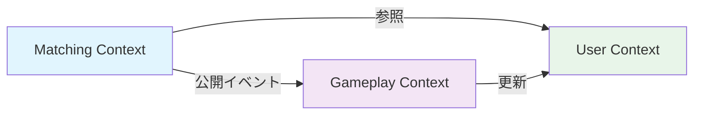

# ステップ3: バウンデッドコンテキスト

## 学習目標

- バウンデッドコンテキストの定義と目的を理解する
- システムを適切に分割する方法を学ぶ
- オクト対戦ゲームのバウンデッドコンテキストを理解する

---

## 3.1 バウンデッドコンテキストとは

**バウンデッドコンテキスト（Bounded Context）** とは、**特定のドメインモデルが適用される境界**のことです。

### イメージ

```
┌─────────────────────────────────────────────────────────┐
│                     オクト対戦システム                    │
├─────────────────────────────────────────────────────────┤
│                                                           │
│  ┌──────────────┐  ┌──────────────┐  ┌──────────────┐  │
│  │ Matching     │  │ Gameplay     │  │ User         │  │
│  │ Context      │  │ Context      │  │ Context      │  │
│  │              │  │              │  │              │  │
│  │ - Room       │  │ - Board      │  │ - User       │  │
│  │ - Matching   │  │ - Move       │  │ - Rating     │  │
│  └──────────────┘  └──────────────┘  └──────────────┘  │
│                                                           │
└─────────────────────────────────────────────────────────┘
```

各コンテキストは独立したモデルを持ち、異なる用語やルールを使用できます。

---

## 3.2 なぜ分割が必要なのか

### 問題：1つの巨大なモデル

```typescript
// 全てを1つのモデルで表現しようとすると...

class User {
  id: number;
  name: string;
  email: string;
  passwordHash: string;
  rating: number;
  // ここまでは良いが...

  // 以下のプロパティも追加されると？
  currentGameId: number;           // Gameplayコンテキスト
  searchingForMatch: boolean;      // Matchingコンテキスト
  notificationSettings: any;       // Notificationコンテキスト
  paymentInfo: any;                // Paymentコンテキスト（将来）
  adminPermissions: any;           // Adminコンテキスト（将来）
}
```

このモデルの問題点：
- **肥大化**: どんどんプロパティが増える
- **境界不明**: どの機能がどのプロパティを使っているか不明
- **変更影響大**: 小さな変更でも全体に影響
- **責務不明**: 1つのクラスが全ての責任を持つ

### 解決：コンテキスト分割

```typescript
// User Context
class User {
  id: UserId;
  name: string;
  email: string;
  rating: number;
}

// Matching Context
class MatchingQueue {
  userId: UserId;
  preferences: MatchPreferences;
}

// Gameplay Context
class GameParticipant {
  userId: UserId;
  color: StoneColor;
}
```

各コンテキストが「必要なものだけ」を持つようになります。

---

## 3.3 コンテキスト分割の指針

### 指針1: 変更の理由が異なるなら分割

| コンテキスト | 変更の理由の例 |
|-------------|---------------|
| Matching | 新しいマッチングルール（レーティング差制限等） |
| Gameplay | 新しいゲームモードの追加 |
| User | 認証方法の変更（OAuth追加等） |

### 指針2: 専門性が異なるなら分割

- ユーザー管理の専門家 ≠ ゲームルールの専門家
- マッチングアルゴリズムの専門家 ≠ 盤面判定の専門家

### 指針3: データアクセスパターンが異なるなら分割

- User: 読み取り多、更新少
- Gameplay: 更新頻度高、リアルタイム性重要

---

## 3.4 オクト対戦ゲームのバウンデッドコンテキスト

### 対戦コンテキスト (Matching Context)

```
役割: マッチングと部屋の管理

モデル:
├── Room (部屋)
├── RoomParticipant (参加者)
└── MatchmakingService (マッチングサービス)

責務:
- 部屋の作成・参加
- プレイヤーのマッチング
- 部屋の状態管理（待機中→プレイ中→終了）
```

### ゲームプレイコンテキスト (Gameplay Context)

```
役割: 対戦の進行とルール判定

モデル:
├── Board (盤面)
├── Move (着手)
├── LineCompletionChecker (ライン完成判定)
└── LegalMoveCalculator (合法手計算)

責務:
- 着手の正当性判定
- 石の反転処理
- 勝利条件の判定
- 引き分け判定
```

### ユーザーコンテキスト (User Context)

```
役割: プレイヤーの認証とレーティング管理

モデル:
├── User (ユーザー)
└── RatingService (レーティング計算)

責務:
- ユーザー認証
- ユーザー登録
- レーティング計算・更新
```

---

## 3.5 コンテキスト間の連携

コンテキスト間は独立していますが、連携が必要です。

### 方法1: ドメインイベント（推奨）

```typescript
// Matching Context で発火
class Room {
  start(): void {
    this.status = RoomStatus.PLAYING;

    // イベント発行
    this.publishEvent(new GameStartedEvent({
      roomId: this.id,
      participants: this.participants
    }));
  }
}

// Gameplay Context で購読
class GameStartedEventHandler {
  handle(event: GameStartedEvent): void {
    // ゲームボードの初期化
    this.boardService.initialize(event.roomId);
  }
}
```

### 方法2: インターフェース/API

```typescript
// User Context が提供するインターフェース
interface RatingService {
  getRating(userId: UserId): Promise<number>;
}

// Gameplay Context が呼び出し
class MatchResultProcessor {
  constructor(
    private ratingService: RatingService // 別コンテキストのサービス
  ) {}
}
```

---

## 3.6 コンテキストマップ

複数のコンテキスト間の関係を図示したものです。



### 関係の種類

| 関係 | 説明 |
|------|------|
| **パートナーシップ** | 協力して開発する2つのコンテキスト |
| **共有カーネル** | モデルの一部を共有する |
| **顧客/サプライヤー** | 上流のコンテキストが下流に仕様を提供 |
| **順応者** | 下流が上流のモデルに順応する |
| **防腐層** | 別コンテキストのモデルを変換して使用 |

---

## 確認問題

### Q1: バウンデッドコンテキストを分割する主な目的は？

A. データベースを分割するため
B. チームを分割するため
C. 関心事を分離し、複雑性を管理するため
D. コードを再利用しやすくするため

<details>
<summary>回答</summary>

**正解: C**

バウンデッドコンテキストは、異なる関心事を分離し、各コンテキスト内でのモデルの一貫性を保つことで複雑性を管理するためのものです。
</details>

---

### Q2: オクト対戦ゲームにおいて、「合法手の計算」はどのコンテキストの責務か？

A. Matching Context
B. Gameplay Context
C. User Context

<details>
<summary>回答</summary>

**正解: B**

合法手の計算はゲームプレイのルールに関連するため、Gameplay Context の責務です。
</details>

---

## 次のステップ

[エンティティと値オブジェクト](./04_entity_and_value_object.md) → ドメインモデルを構成する要素を学びます。
